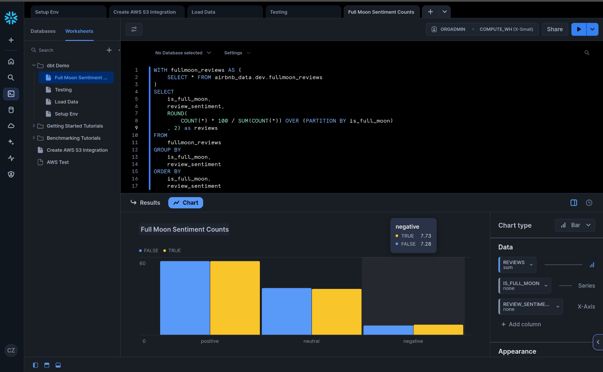

## About The Project
- This is a dbt project meant to demonstrate core functionality. 
- **Please note**: This is a work in progress and I am initially going for *breadth, not depth*. I will
continue to add more depth as I progress.
- In practice this project uses Snowflake as the data warehouse.
- Included examples:
    - Multiple models and sources with differing materializations
    - Multiple basic test examples
    - A simple snapshot
    - Some basic macros
    - Some simple documentation

### To Do
- Analyses
- Hooks
- Exposures
- Logging
- Etc

### Built With
- dbt-core==1.9.4
- dbt-snowflake==1.9.3
- dbt_utils=1.3.0

## The Data

- The data is from [Inside Airbnb](https://insideairbnb.com/get-the-data/), and is a sampling of hosts, listings, and reviews.
- Also included is a seed containing the dates of full moons. In addition to some basic analyses, a quick fun experiment was to see if there is any correlation between full moons and negative reviews.
- As can be seen in the screenshot from Snowflake, negative reviews increase slightly on the day after full moons (but probably not enough to be significant). 